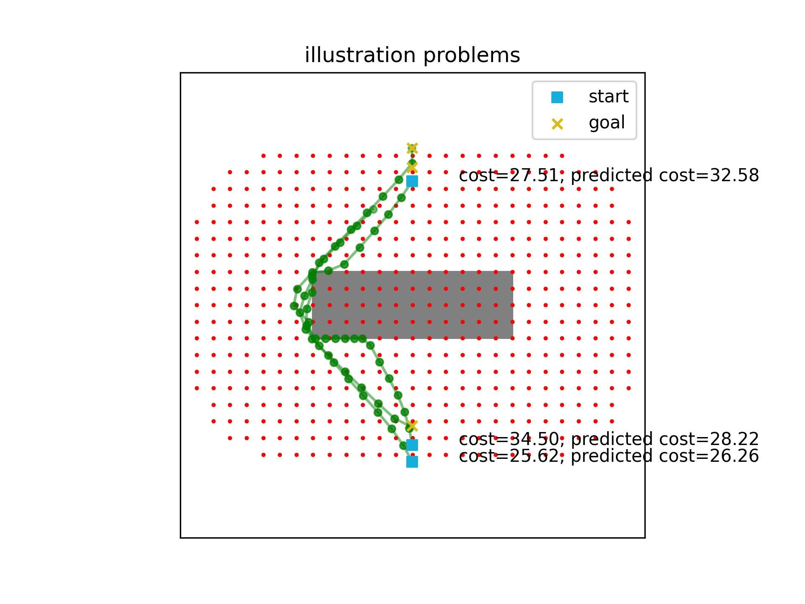
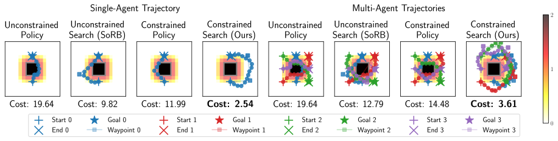
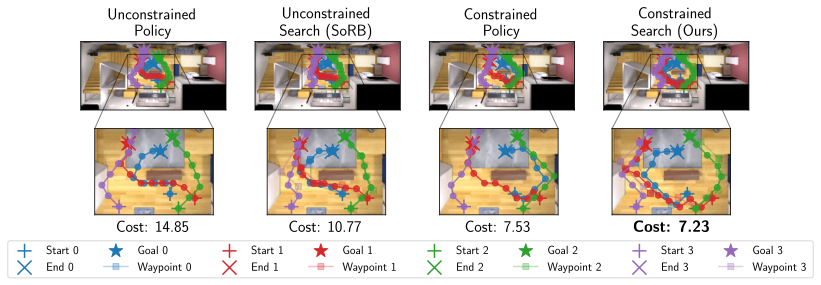

# Safe Multi-Agent Navigation Guided by Goal-Conditioned Safe Reinforcement Learning

This repo is for the safe multi-agent visual navigation problem, where given a set of agents starting from given start locations and a map, we compute their safe trajectories to their respective destinations as quickly as possible while only leveraging visual observations like camera inputs. 


## Overview of Method

Safe navigation is essential for autonomous systems operating in hazardous environments. Traditional planning methods are effective for solving long-horizon tasks but depend on the availability of a graph representation with predefined distance metrics. In contrast, safe Reinforcement Learning (RL) is capable of learning complex behaviors without relying on manual heuristics but fails to solve long-horizon tasks, particularly in goal-conditioned and multi-agent scenarios.

In this paper, we introduce a novel method that integrates the strengths of both planning and safe RL. Our method leverages goal-conditioned RL and safe RL to learn a goal-conditioned policy for navigation while concurrently estimating cumulative distance and safety levels using learned value functions via an automated self-training algorithm. By constructing a graph with states from the replay buffer, our method prunes unsafe edges and generates a waypoint-based plan that the agent then executes by following those waypoints sequentially until their goal locations are reached. This graph pruning and planning approach via the learned value functions allows our approach to flexibly balance the trade-off between faster and safer routes especially over extended horizons.

Utilizing this unified high-level graph and a shared low-level goal-conditioned safe RL policy, we extend this approach to address the multi-agent safe navigation problem. In particular, we leverage Conflict-Based Search (CBS) to create waypoint-based plans for multiple agents allowing for their safe navigation over extended horizons. This integration enhances the scalability of goal-conditioned safe RL in multi-agent scenarios, enabling efficient coordination among agents. Extensive benchmarking against state-of-the-art baselines demonstrates the effectiveness of our method in achieving distance goals safely for multiple agents in complex and hazardous environments. Our code will be released to support future research.

## Requirements

```sh
conda env create -f environment.yml
```

## Installing habitat-sim
### Download (testing) 3D scenes
```bash
python -m habitat_sim.utils.datasets_download --uids habitat_test_scenes --data-path /path/to/data/
```
### Download example objects
```bash
python -m habitat_sim.utils.datasets_download --uids habitat_example_objects --data-path /path/to/data/
```
### Setup Replica CAD (Not Replica Dataset)
Replica CAD is a simpler and painless version of Replica Dataset. Replica Dataset may have been deprecated: see [Github Issue](https://github.com/facebookresearch/habitat-sim/issues/2335)
```bash
sudo apt install git-lfs
target_dir=external_data/replica_cad
GIT_CLONE_PROTECTION_ACTIVE=false python -m habitat_sim.utils.datasets_download --uids replica_cad_dataset replica_cad_baked_lighting --data-path $target_dir
```
Verify it is working with interactive viewer
```bash
habitat-viewer --dataset ${target_dir}/replica_cad_baked_lighting/replicaCAD_baked.scene_dataset_config.json -- sc1_staging_00
```

Before you run any code ensure that the repository root is added to your PYTHONPATH,
```bash
export PYTHONPATH="{PYTHONPATH}:/path/to/safe-visual-mapf"
```

## Train with Visual Inputs
```bash
sbatch launch_jobs/cloud_debug_vec_habitat.sh # On MIT supercloud GPU node
bash launch_jobs/local_debug_vec_habitat.sh # Locally, may not work due to memory limit
```
**Important**: The base SORB algorithm is sensitive to random seeds. This is undocumented in the original SORB paper. Consequently, training with vectorized env will not converge. Make sure to set the num_envs to 1 in vec training. In addition, the replay buffer size seems to matter as well. Currently, only training on MIT Supercloud with a experience replay buffer size of 100K has been proven to work.  

## Experiments


## You may design custom evaluation problems for illustration
**Step 1**: Generate a figure of the 2D maze
**Step 2**: Load the image into [WebPlotDigitizer](https://apps.automeris.io/wpd/), manually align the x and y axes by selecting the start and end points. 
**Step 3**: Pick the start and goal positions from the figure, click "View Data" button, copy the coords to a new file under [illustration_set](pud/envs/safe_pointenv/illustration_set) illustration following the specification [here](pud/envs/safe_pointenv/illustration_set/README.md).

## Coordinate Convention for 2D Maze

The maze is defined in numpy array. For example:
```python
L = np.array([[0, 0, 0, 0, 0, 0, 0],
              [0, 0, 1, 0, 0, 0, 0],
              [0, 0, 1, 0, 0, 0, 0],
              [0, 0, 1, 0, 0, 0, 0],
              [0, 0, 1, 1, 1, 0, 0],
              [0, 0, 0, 0, 0, 0, 0],
              [0, 0, 0, 0, 0, 0, 0]])
```

However, the visualization of this maze via matplotlib will display an L in a different orientation (e.g., CCW 90 deg). 


In our case, we don't bother with it. If we really want to have the L shape in the vertical standup orientation, we change the maze definition in numpy array and rotate it CW 90 deg. The reason is to make the coordinates of visualization and points picked from visualization consistent with the internal maze coordinates. Although they look different due to different representation pipeline, they are internally the same thing. This makes it easy to manually craft benchmark problems by selecting start and goal coordinates from the maze image (e.g., the dots and lines on the image above).

For detailed example and visualization, read [experiment slides](readme_resources/experiment_slides.pptx). 
Example code: [test_plot_orientation.py](pud/envs/safe_pointenv/unit_tests/test_plot_orientation.py).

## Coordinate Convention for Visual Navigation (Habitats ReplicaCAD)

Again, we ignore any orientation discrepancy between the numpy array and visualization. The points taken from the visualization can be used as internal states without additional transformation.

Example code: [vis_handed_crafted_waypoints_w_topdown_maps in test_replica_cad_barebone.py](pud/envs/safe_habitatenv/unit_tests/test_replica_cad_barebone.py)
Video proof of matching coordinate: [trace_bounds.mp4 -- Trace map bounds by manual point selection](readme_resources/trace_bounds.mp4)

## Setup on Supercloud
Habitat only works on GPU nodes. The setup process, however, takes place on the initial login node without access to GPU. Load the necessary module to install cuda-enabled pytorch without access to GPU/CUDA.
```bash
module load anaconda/2023a-pytorch
module load cuda/11.8
module load nccl/2.18.1-cuda11.8
```

Installation on Supercloud requires creating a custom conda environment. Note this will reduce the I/O speed because the user space locates on network drive. 
```bash
conda env create -f environment.yml
source activate safe_visual_mapf
```
Setup of ReplicadCAD follows the same procedure as above.

## Experimental Design
see [slides](readme_resources/experiment_slides.pptx)

## Visualize trained policy (2D maze)
Select or create an illustration problem set from [pud/envs/safe_pointenv/illustration_set](pud/envs/safe_pointenv/illustration_set) following the file specification rule. 

Also choose 

- Trained policy ckpt file
- Configuration file (.yaml) used for training that ckpt

```bash
bash launch_jobs/local_illustration_eval.sh
```
**Example output**: 
<p align="center">

</p>


## Experimental Reproduction

To reproduce the results as described in the paper, please follow these instructions

1. Download the codebase
2. Export the python path and point it to the root directory of this codebase
```sh
export PYTHONPATH=/path/to/codebase
```
3. Download the models inside the base directory by clicking the following [link](https://nas.mers.csail.mit.edu/sharing/dzVKC2O83)
    - Unzip the models
        ```sh
        unzip models.zip
        ```
4. Run the python illustration notebooks provided in `pud/plots/` to re-generate the plots in the paper
    - Use `plot_pointenv_illustration.ipynb` for 2D Navigation related experiments
    - Use `plot_habitat_illustration.ipynb` for Visual Navigation related experiments
5. Benchmark the approach on different problems
    - Ensure that the script is executable
        ```sh
            chmod u+x pud/plots/collect_all_trajs.sh
        ```
    - Generate your own problems
        ```sh
        pud/plots/collect_all_trajs.sh <env_name> <config_path> <unconstrained_ckpt_path> <constrained_ckpt_path> true 
        ```
    - Collect the new trajectories corresponding to the new problems
        ```sh
            pud/plots/collect_all_trajs.sh <env_name> <config_path> <unconstrained_ckpt_path> <constrained_ckpt_path>
        ```
6. Run the python metrics notebooks provided in `pud/plots/` to re-generate the data used for tables in the paper. Note that you will need to 
    - Use `plot_pointenv_metrics.ipynb` for 2D Navigation related experiments
    - Use `plot_habitat_metrics.ipynb` for Visual Navigation related experiments
7. To use the same data that was use to generate the results in the paper, simply download that data using the following [link](https://nas.mers.csail.mit.edu/sharing/nJ0UcyTNu)
    - Unzip the data inside `pud/plots/` directory
        ```sh
        unzip data.zip -d /path/to/pud/plots/
        ```
    Rerun Step 6.

## Extra Notes:
1. The launch scripts can be found in the `launch_jobs/` directory
2. You may visualize individual steps of the approach using the scripts inside `pud/visualizers/` directory
    - Use `gen_graph.py` for 2D Navigation problems
    - Use `gen_visual_nav_graph.py` for Visual Navigation problems


## Results
### 2D Navigation


### Visual Navigation

